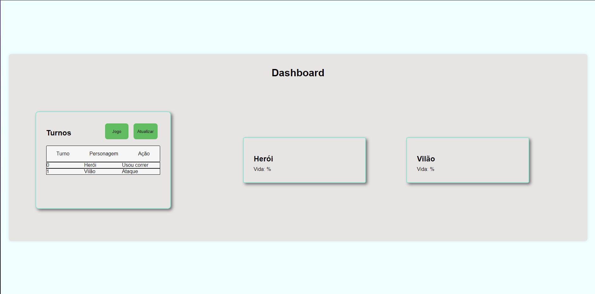

# Projeto: Avaliação Web - Herói e Vilão

Este projeto consiste no desenvolvimento de uma aplicação web utilizando VueJS, Node.js e Banco de Dados Azure. A aplicação permite aos usuários realizarem login, cadastro, jogar a Avaliação Web (Herói e Vilão) e visualizar dados gerados durante o jogo em um dashboard. Os dados do jogo serão armazenados no Banco de Dados Azure.

## Funcionalidades

1. **Cadastro de Usuário**: Permite que novos usuários se cadastrem na aplicação.
2. **Login de Usuário**: Permite que usuários cadastrados façam login na aplicação.
3. **Jogar com o Herói**: Permite que os usuários joguem com o herói do jogo.
4. **Dashboard de Dados**: Permite visualizar os dados gerados durante o jogo em um dashboard. Estes dados são armazenados no Banco de Dados Azure.

## Tecnologias Utilizadas

- **Front-end**: VueJS
- **Back-end**: Node.js
- **Banco de Dados**: Azure MS SQL Database

## Pré-requisitos

- Node.js
- Vue CLI

## Configuração do Ambiente


   ```bash
   git clone https://github.com/seu-usuario/projeto-avaliacao-web.git
   cd projeto-avaliacao-web
   npm install
   npm start
   ```


## Uso

##### Link do jogo https://prova-2sem-webii.onrender.com/

1. **Cadastro e Login:**
   - Acesse a página de cadastro para criar uma nova conta.
   - 
   - Utilize as credenciais cadastradas para fazer login.
   - 

2. **Jogar Avaliação Web (Herói e Vilão):**
   - Após o login, navegue até a página do jogo e inicie a avaliação.
   - 

3. **Visualizar Dashboard:**
   - Após jogar a avaliação, acesse o dashboard para visualizar os dados gerados durante o jogo.
   - 

## Contribuição

1. Faça um fork do projeto.
2. Crie uma nova branch com a sua feature: `git checkout -b minha-feature`
3. Faça commit das suas mudanças: `git commit -m 'Minha nova feature'`
4. Faça push para a branch: `git push origin minha-feature`
5. Envie um Pull Request.

## Licença

Este projeto está licenciado sob a Licença MIT. Veja o arquivo [LICENSE](LICENSE) para mais detalhes.

## Contato

Para mais informações, entre em contato com [ramonfrancocastro@gmail.com].
